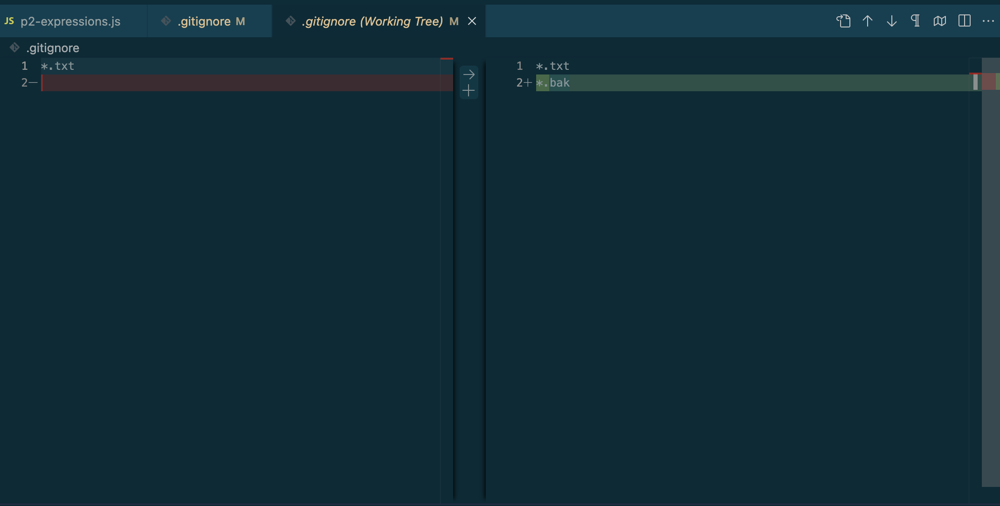
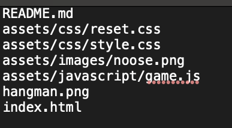
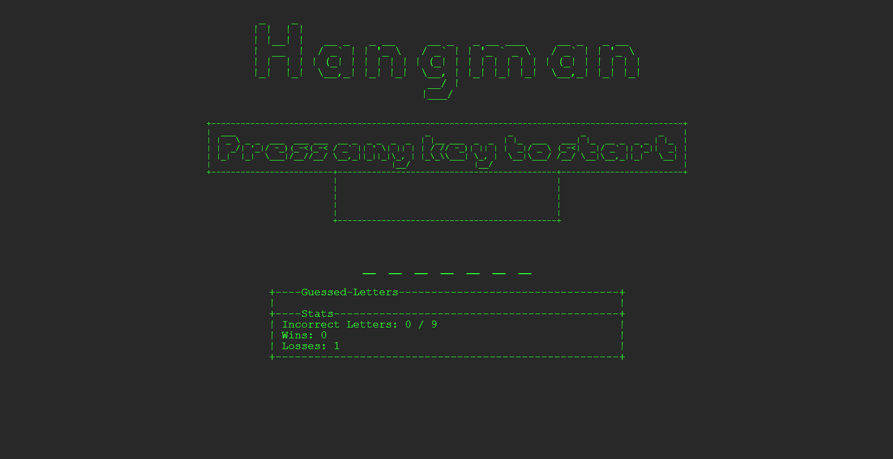

# Project 2: Git and JavaScript Refactoring

Welcome to my Project 2 page for **CIT 281**.

---

## Purpose

This project focused on using Git with the command line and VSCode, refactoring JavaScript code from Project 1, implementing a `.gitignore` file, and practicing Git features like `diff` and source control.

---

## Technologies Used

- Git (command line and VSCode)
- JavaScript
- Node.js
- VSCode

---

## Lab: Git and Refactoring Practice

This lab focused on mastering command line interface (CLI) commands for file and directory management, Git setup and operations including branching, staging, ignoring files, using diff, cloning repositories, and integrating Git with VS Code.

---

## What I Learned

- How to manage source control using Git CLI and VSCode integration.
- The importance and usage of `.gitignore` files.
- Code refactoring techniques to improve readability and organization.
- Using Git commands like `diff` to track changes effectively.

---

## Project Images

---

## Lab Images

---

Thanks for visiting my Project 2 page!

[Back to Portfolio](https://arissas24.github.io/)
